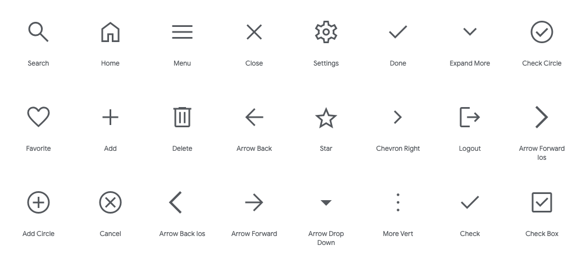

# Base

The `base/` folder holds what we might call the boilerplate code for the project. In there, you might find some typographic rules, and probably a stylesheet (that I’m used to calling `_base.scss`), defining some standard styles for commonly used HTML elements.

Reference: [Sass Guidelines](https://sass-guidelin.es/) > [Architecture](https://sass-guidelin.es/#architecture) > [Base folder](https://sass-guidelin.es/#base-folder)

## Fonts

| DM Sans | DM Serif Display | Roboto | Mona Sans | Hubot Sans |
|-|-|-|-|-|
|  |  |  |  |  |

> Not pictured: Figtree, Outfit

## Icons

| Material Icons | Community Material Icons |
|-|-|
|  |  |
