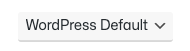

# Components

For small components, there is the `components/` folder. While `layout/` is macro (defining the global wireframe), `components/` is more focused on widgets. It contains all kind of specific modules like a slider, a loader, a widget, and basically anything along those lines. There are usually a lot of files in components/ since the whole site/application should be mostly composed of tiny modules.

Reference: [Sass Guidelines](https://sass-guidelin.es/) > [Architecture](https://sass-guidelin.es/#architecture) > [Components folder](https://sass-guidelin.es/#components-folder)

| Button | Checkbox | Input | Radio |
| - | - | - | - |
|  |  |  |  |